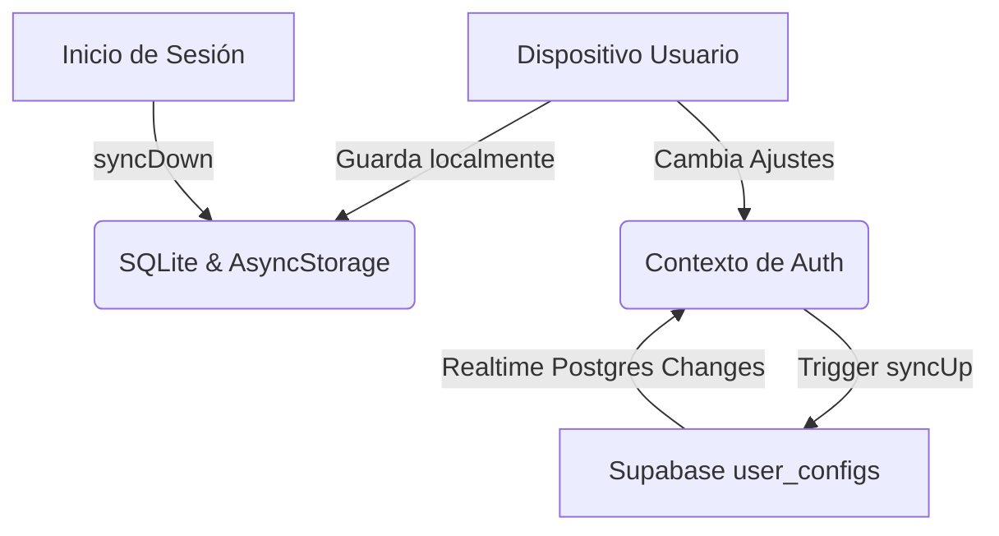

# Arquitectura de la Aplicación (FinanzasApp)

Este documento describe la arquitectura global, el flujo de datos y las tecnologías clave que sostienen la aplicación.

---

## 🛠️ Stack Tecnológico

1. **Frontend (App Móvil):**
   * **Expo v54 (React Native):** Framework principal.
   * **Expo Router (v6):** Enrutamiento basado en archivos (File-based routing).
   * **React Native Reanimated & Gesture Handler:** Animaciones e interacción fluida.
   * **React Native SVG & Chart Kit:** Visualización de estadísticas y gráficos financieros.

2. **Base de Datos y Almacenamiento Local (Offline First):**
   * **Expo SQLite (v16):** Base de datos relacional local en el dispositivo para transacciones, deudas, retos y metas.
   * **AsyncStorage / Expo SecureStore:** Para configuraciones persistentes simples (tema, sesión, tokens de seguridad).

3. **Backend y Sincronización en la Nube:**
   * **Supabase:** Plataforma backend para:
     * **Autenticación:** Supabase Auth (Email/Password y Google OAuth).
     * **Base de Datos Remota:** Tabla `user_configs` para guardar configuraciones sincronizadas del usuario.

---

## 📂 Estructura de Directorios Clave

* **`/app`**: Contiene las pantallas y la lógica de navegación (Expo Router).
  * **`/(tabs)`**: Pantallas principales del menú inferior (Inicio, Tarjetas, Deudas, Inversión, Perfil, etc.).
  * **`/challenge`**: Retos de ahorro.
  * **`login.tsx` / `register.tsx`**: Vistas de autenticación.
* **`/components`**: Componentes reutilizables de la UI (botones, tarjetas, modales).
* **`/constants`**: Paletas de colores, temas, tipografía.
* **`/hooks`**: Hooks personalizados de React.
* **`/utils`**: Clases de ayuda y servicios principales.

---

## 🔗 Relaciones con el Cerebro
* Ver el esquema detallado de datos en [[esquema-db]].
* Ver la explicación lógica de los procesos en [[flujos]].

---

## 🔄 Flujo de Sincronización (Offline-First)

1. **Lectura local rápida:** Cuando el usuario abre la aplicación, los datos se leen directamente de **SQLite** y **AsyncStorage**, logrando un tiempo de carga instantáneo.
2. **Sincronización en segundo plano:** Tras iniciar sesión o realizar cambios de configuración, el servicio de sincronización (`sync.ts`) actualiza la tabla remota en Supabase sin bloquear la interfaz.
3. **Escucha en tiempo real:** Se abre un canal de tiempo real (Realtime Channel) con Supabase para escuchar cambios y sincronizar instantáneamente múltiples dispositivos del mismo usuario.
