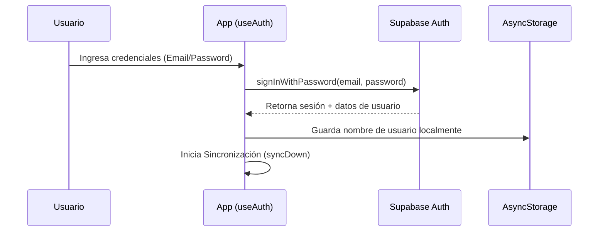

# Flujos de la Aplicación

Este archivo detalla el comportamiento lógico paso a paso de los procesos más importantes y complejos del sistema: el inicio de sesión, el registro y la sincronización de datos.

---

## 🔗 Relaciones con el Cerebro
* Ver la estructura y flujo del sistema en [[arquitectura]].
* Ver la estructura de tablas de datos en [[esquema-db]].

---

## 🔐 1. Flujo de Autenticación

El sistema de autenticación se maneja a través de **Supabase Auth** con persistencia en el dispositivo.

### Detalle de Métodos
1. **Inicio de sesión tradicional (`login`)**:
   * Envía las credenciales a `supabase.auth.signInWithPassword`.
   * El listener `onAuthStateChange` detecta la sesión activa.
   * Guarda el nombre del usuario localmente en `@user_name_{userId}`.
2. **Registro (`register`)**:
   * Ejecuta `supabase.auth.signUp`.
   * Un trigger automático en la base de datos de Supabase crea el perfil del usuario.
3. **Inicio de sesión con Google (`signInWithGoogle`)**:
   * Inicia el flujo OAuth mediante `supabase.auth.signInWithOAuth`.
   * Utiliza `WebBrowser.openAuthSessionAsync` para abrir el navegador seguro del sistema y capturar la URL de redirección.
   * Procesa la URL de callback para extraer el `access_token` y `refresh_token`.
   * Actualiza la sesión localmente con `supabase.auth.setSession`.

---

## 🔄 2. Flujo de Sincronización (Sync)

La sincronización se realiza en segundo plano para garantizar que el usuario pueda usar la aplicación inmediatamente sin conexión a Internet (Offline-First).

### Sincronización hacia la Nube (`syncUp`)
Se ejecuta cuando el usuario cambia configuraciones, temas, cuentas personalizadas, tarjetas o completa el tutorial.
1. Recopila todas las llaves persistentes de `AsyncStorage` específicas de ese usuario.
2. Genera un objeto JSON estructurado con toda la configuración.
3. Ejecuta una operación **upsert** en la tabla `user_configs` de Supabase usando el ID de usuario como clave única.

### Sincronización desde la Nube (`syncDown`)
Se ejecuta en segundo plano en el inicio de la app o después de iniciar sesión.
1. Consulta la fila correspondiente en `user_configs` de Supabase para el `user_id` activo.
2. Si encuentra configuración remota, realiza escrituras por lotes (`Promise.all`) a `AsyncStorage` local.
3. Actualiza el estado del contexto de React (`theme`, `currency`, `cards`, etc.) para refrescar la UI.
